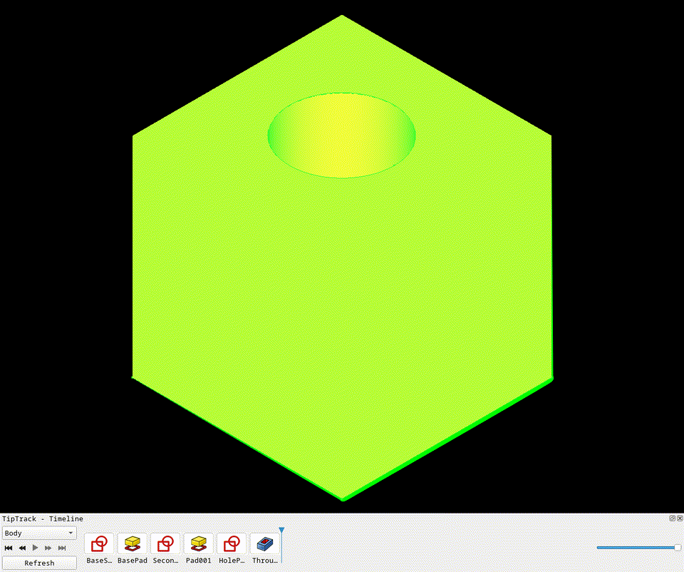
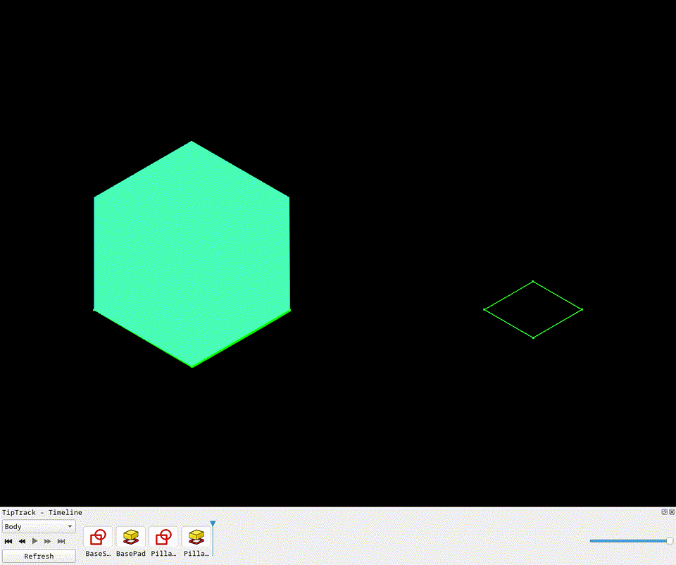

<!-- SPDX-License-Identifier: CC0-1.0 -->
<!-- SPDX-FileNotice: Project README for TipTrack. -->

# TipTrack

TipTrack is a FreeCAD addon that shows the active `PartDesign::Body` feature
history as a horizontal docked timeline. Click or drag the playhead to roll the
model back and forward through its history, double-click a card to edit, and
drag cards to reorder features within their dependency constraints.



## Features

### Timeline scrubber

Scrub through the full feature history with a click or keyboard arrows. Slider
position ``0`` is *before the first feature*: the Body tip is cleared, timeline
geometry is hidden in the 3D view, and the viewport shows nothing until you
scrub forward. At the first sketch (or any step before the first solid PartDesign
tip), only that sketch is shown in the 3D view while the Body and later features
stay hidden. Once the tip is a solid feature again, the Body and your saved
visibility settings are restored. Positions ``1`` through ``N`` step through
``Body.Group`` in order (the first card is at position ``1``). The triangular
playhead sits just left of the first thumbnail at position ``0``, and at the
right edge of the active card for later positions. The dock slider mirrors the
same positions. Thumbnails from the current position onward are dimmed so
future history stays visible but subdued.

### Drag-to-reorder

Drag a feature card left or right to reorder it. TipTrack checks dependency
constraints before accepting the drop — features that would break a sketch-pad
link are rejected with a tooltip explaining why.



## Install

TipTrack targets FreeCAD 1.0 or newer.

### Windows copy install

Copy this repository folder to FreeCAD's user `Mod` directory as `TipTrack`:

```text
%APPDATA%\FreeCAD\Mod\TipTrack
```

The resulting layout should look like this:

```text
%APPDATA%\FreeCAD\Mod\TipTrack\
├── freecad\
│   └── TipTrack\
├── Resources\
├── package.xml
└── README.md
```

Restart FreeCAD. The dock should appear at the bottom as `TipTrack - Timeline`.

### Windows development install

For development, a junction is easier than copying because FreeCAD loads the
repo directly:

```powershell
$mod = Join-Path $env:APPDATA "FreeCAD\Mod"
New-Item -ItemType Directory -Force -Path $mod
New-Item -ItemType Junction -Path (Join-Path $mod "TipTrack") -Target "C:\Users\Rchie\Music\Timeline"
```

Remove the junction with:

```powershell
Remove-Item "$env:APPDATA\FreeCAD\Mod\TipTrack"
```

### Addon Manager

Once published, TipTrack should be installable through FreeCAD's Addon Manager
from the repository URL.

## Test

### Python checks in Docker

Run the normal test and static-check suite from the repo root:

```powershell
docker run --rm -v "${PWD}:/work" -w /work python:3.12-slim sh -lc "python -m pip install --quiet pytest ruff && pytest -q && python -m compileall -q freecad tests && python - <<'PY'
import xml.etree.ElementTree as ET
ET.parse('package.xml')
print('package.xml parsed')
PY
ruff check freecad tests"
```

Expected result: all pytest tests pass, `package.xml parsed`, and Ruff reports
`All checks passed!`.

### FreeCAD GUI integration tests in Docker

Two integration tests run FreeCAD 1.0.2 under Xvfb, build a PartDesign model,
exercise the TipTrack dock, and write screenshots + a summary JSON to
`artifacts/`.

| Test | Script | What it covers |
|---|---|---|
| Scrubber smoke | `freecad_tiptrack_gui_smoke.py` | Playhead rollback, volume checks, 6-frame screenshots |
| Reorder smoke | `freecad_tiptrack_reorder_smoke.py` | Valid reorder, 3 rejected moves, scrub after reorder |

On Windows, run both tests with the helper script:

```bat
run-freecad-integration.bat
```

When **ffmpeg** is on `PATH`, the script also encodes MP4 and GIF recordings
from the frame screenshots automatically.

Artifacts written to `artifacts/`:

| File | Description |
|---|---|
| `freecad-tiptrack-integration.gif` / `.mp4` | Scrubber test recording |
| `freecad-tiptrack-reorder.gif` / `.mp4` | Reorder test recording |
| `tiptrack_integration.FCStd` | Saved model from scrubber test |
| `tiptrack_reorder.FCStd` | Saved model from reorder test |
| `tiptrack_integration_summary.json` | Volumes, frame paths |
| `tiptrack_reorder_summary.json` | Group order, volumes, frame paths |

Full project notes live in [Documentation/README.md](Documentation/README.md).

## Known Issues

- The Docker GUI smoke test validates dock loading and timeline behavior, but a
  manual Addon Manager install test is still needed before publishing.
- Drag reorder depends on FreeCAD 1.0+ `PartDesign::Body.insertObject` behavior
  and may still surface FreeCAD recompute warnings for fragile model references.
- Timeline folder metadata helpers exist, but folder UI grouping is not exposed
  yet.

## Release Notes

See [CHANGELOG.md](CHANGELOG.md).
